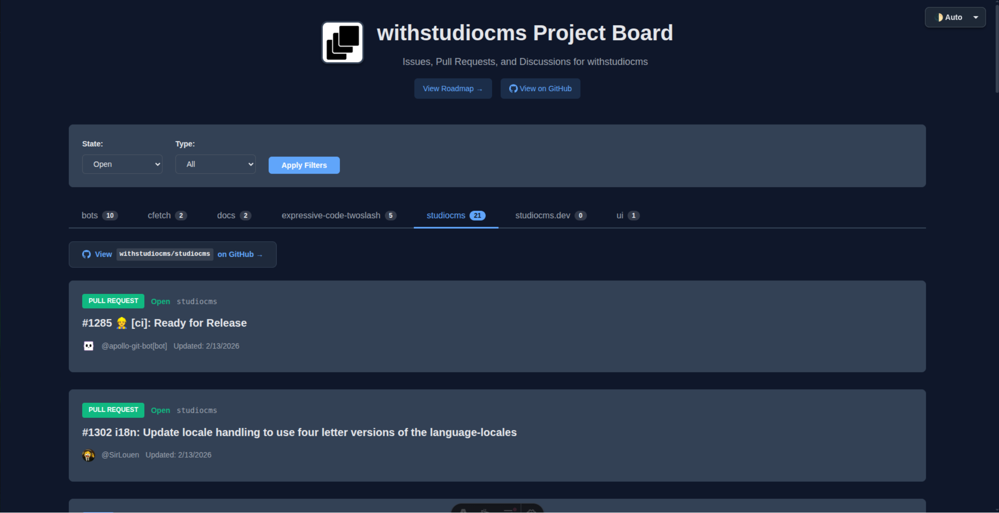

# GitHub Project Board



A server-side rendered Astro application that provides a unified view of GitHub issues, pull requests, and discussions for any GitHub organization. Features repository tabs, advanced filtering, and a dedicated roadmap page with README viewer.

## Features

- **Repository Tabs**: Browse issues and PRs by repository with alphabetical sorting
- **Advanced Filtering**: Filter by state (open/closed/all), type (issue/PR/discussion/all), and repository
- **Roadmap Page**: Dedicated roadmap view with three-column layout (Discussions, Issues, PRs)
- **README Viewer**: View repository README files in a modal dialog with markdown rendering
- **Theme Support**: Light, dark, and auto modes with persistent preference
- **Responsive Design**: Mobile-friendly interface that works on all devices
- **Smart Caching**: In-memory cache with 5-minute TTL for faster performance
- **Quick Navigation**: Direct links to GitHub organization and repositories

## Tech Stack

- **Astro v5** - SSR-enabled with @astrojs/node adapter
- **TypeScript** - Type-safe development
- **GitHub REST API** - Issues, PRs, releases, repositories
- **GitHub GraphQL** - Discussions (requires token)
- **markdown-it** - Markdown parsing for README viewer
- **CSS Variables** - Comprehensive theming system

## Getting Started

### Prerequisites

- Node.js 18+ or latest LTS
- pnpm package manager
- (Optional) GitHub Personal Access Token for higher rate limits

### Installation

```bash
# Install dependencies
pnpm install

# Start development server
pnpm dev

# Build for production
pnpm build

# Preview production build
pnpm preview
```

## Project Structure

```
/
├── src/
│   ├── components/
│   │   ├── FilterBar.astro       # State/type filter controls
│   │   ├── GitHubItem.astro      # Individual item card display
│   │   ├── ThemeSelector.astro   # Light/dark/auto theme switcher
│   │   └── ThemeManager.astro    # Client-side theme management
│   ├── layouts/
│   │   └── BaseLayout.astro      # Main layout with header/nav/footer
│   ├── lib/
│   │   └── github.ts             # GitHub API integration + caching
│   ├── pages/
│   │   ├── index.astro           # Main board with repository tabs
│   │   └── roadmap.astro         # Roadmap page with README viewer
│   ├── styles/
│   │   └── global.css            # Unified styles with CSS variables
│   └── config.ts                 # Project configuration
├── public/                       # Static assets
├── .env.example                  # Environment variables template
├── astro.config.mjs              # Astro configuration
└── package.json
```

## GitHub Integration

This project integrates with GitHub using both REST and GraphQL APIs, handled in [src/lib/github.ts](src/lib/github.ts):

### REST API
- Issues, pull requests, and releases
- Repository metadata and listings
- README content fetching
- Works without authentication (lower rate limits)

### GraphQL API
- Discussions (requires authentication)
- Configurable via `enableDiscussions` in config

### Caching
All API responses are cached in memory with a 5-minute TTL to improve performance and reduce API calls.

## Configuration

The project is configured via [src/config.ts](src/config.ts):

```typescript
export const config: ProjectConfig = {
  // GitHub organization to monitor
  organization: 'withstudiocms',
  
  // Optional: GitHub token for higher rate limits
  // You can also set this via GITHUB_TOKEN environment variable
  githubToken: import.meta.env.GITHUB_TOKEN || '',
  
  // List specific repositories to display
  // Leave empty ([]) to show all repositories
  allowedRepositories: [],
  // Example: ['astro-studiocms', 'studiocms-website']
  
  // Maximum items to fetch per request
  maxItemsPerPage: 100,
  
  // Enable/disable discussions (requires GraphQL API)
  enableDiscussions: false,
  
  // Repository used for roadmap page
  roadmapRepository: 'roadmap',
  
  // Default repository tab to show on index page
  defaultRepository: 'astro-studiocms',
  
  // Custom function to sort repositories
  // Default: alphabetical sort
  repositorySort: (repos) => repos.sort((a, b) => 
    a.name.localeCompare(b.name)
  ),
};
```

### Repository Configuration

**Filtering Repositories**: Limit display to specific repos:
```typescript
allowedRepositories: ['repo1', 'repo2', 'repo3']
```

**Default Repository**: Set which repository tab opens by default on the index page:
```typescript
defaultRepository: 'your-main-repo'
```

**Repository Sorting**: Customize how repositories are sorted in tabs. Examples:
```typescript
// Alphabetical (default)
repositorySort: (repos) => repos.sort((a, b) => a.name.localeCompare(b.name))

// By star count (descending)
repositorySort: (repos) => repos.sort((a, b) => b.stargazers_count - a.stargazers_count)

// Custom order with fallback to alphabetical
repositorySort: (repos) => {
  const order = ['main-repo', 'docs', 'examples'];
  return repos.sort((a, b) => {
    const aIndex = order.indexOf(a.name);
    const bIndex = order.indexOf(b.name);
    if (aIndex !== -1 && bIndex !== -1) return aIndex - bIndex;
    if (aIndex !== -1) return -1;
    if (bIndex !== -1) return 1;
    return a.name.localeCompare(b.name);
  });
}
```

### Roadmap Configuration

Set the repository name used for the roadmap page:
```typescript
roadmapRepository: 'roadmap'
```

This repository's discussions, issues, and pull requests will be displayed on `/roadmap` in a three-column layout. The README from this repository can be viewed in a modal dialog.

### GitHub API Rate Limits

- **Without token**: 60 requests per hour
- **With token**: 5,000 requests per hour

To get a token:
1. Go to https://github.com/settings/tokens
2. Generate a new token (classic)
3. Select scopes: `public_repo` (for public repos) or `repo` (for private repos)
4. Add to `.env` file: `GITHUB_TOKEN=your_token_here`

## Pages

### Index Page (`/`)
- **Repository Tabs**: Browse issues and PRs by repository
- **Filtering**: State (open/closed/all) and type (issues/PRs/discussions/all)
- **List View**: Single-column list of items with labels and metadata
- **Navigation**: Links to GitHub org and individual repositories

### Roadmap Page (`/roadmap`)
- **Three-Column Layout**: Discussions, Issues, and Pull Requests
- **README Viewer**: Click "View README" to open a modal with rendered markdown
- **Markdown Features**: Full heading hierarchy, code blocks, tables, anchor links
- **Smooth Scrolling**: Navigate README via table of contents

## Styling System

All styles are centralized in [src/styles/global.css](src/styles/global.css) using CSS variables:

- **Root Variables**: Colors, shadows, borders, and typography
- **Dark Theme**: Automatic overrides via `[data-theme="dark"]`
- **Component Styles**: Shared styles for filters, cards, badges, and layouts
- **Theme Persistence**: User preference saved to localStorage

Components contain minimal component-specific CSS only.

## Development

The application uses Astro's SSR mode with the Node.js adapter. Each page request:

1. Fetches data from GitHub (with caching)
2. Applies user-selected filters
3. Renders the complete page server-side
4. Delivers ready-to-view HTML to the browser

### Development Server

```bash
pnpm dev
```

The dev server includes:
- Hot module reloading
- TypeScript type checking
- Astro's SSR preview

## Deployment

Build the project and deploy with a Node.js compatible hosting service:

```bash
# Build for production
pnpm build

# Preview production build locally
pnpm preview
```

The application requires a Node.js environment for SSR. Compatible platforms include:

- **Vercel**: Zero-config deployment with automatic SSR support
- **Netlify**: Enable SSR in build settings
- **Railway**: Node.js deployment with environment variables
- **Any VPS**: Run `node dist/server/entry.mjs` after build

### Environment Variables

Set these in your hosting platform:

```bash
GITHUB_TOKEN=your_github_personal_access_token
```

## Browser Support

- Modern browsers with CSS Grid and Custom Properties support
- Native dialog element support (Chrome 37+, Firefox 98+, Safari 15.4+)
- JavaScript required for theme persistence and dialog interactions

## Contributing

1. Fork the repository
2. Create a feature branch
3. Make your changes
4. Update tests and documentation
5. Submit a pull request

## License

MIT
